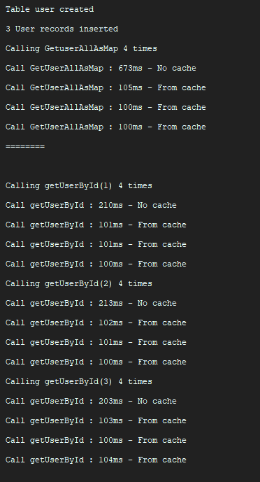

# Ajout d'un cache Redis à une application existante

Le commit nommé "redis" montre comment l'implémentation du cache Redis avec Jedis.

La syntaxe (indentation notamment) est délibérément délaissée pour que le résumé de commit soit clair sur les modifications faites. (Sinon toutes les lignes indentées auraient été marquées comme modifiées).

2 librairies supplémentaires ont étés importées : Gson (Pour la serialization) et Jedis (Pour l'utilisation de redis)

# Fonctionnement de la fonction Main
La fonction main effectue 4 fois de suite des requêtes sur les différentes routes (getAll, puis getById sur les trois id)
On remarque qu'à chaque fois, le premier appel prend beaucoup plus de temps, alors que les appels suivants prennent toujours environ 100ms (chez moi)

